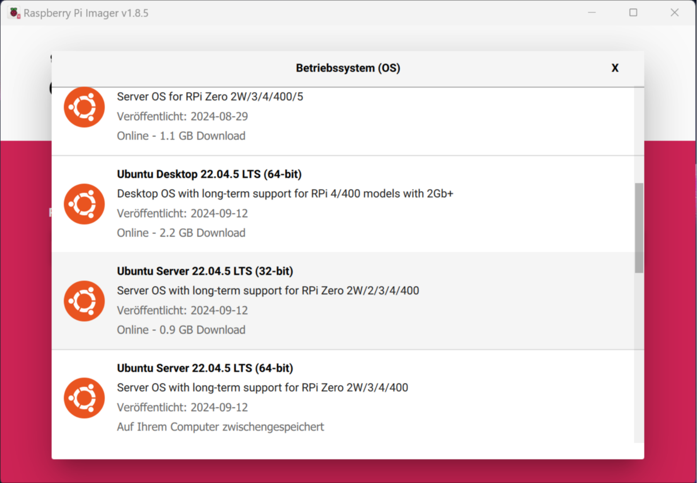
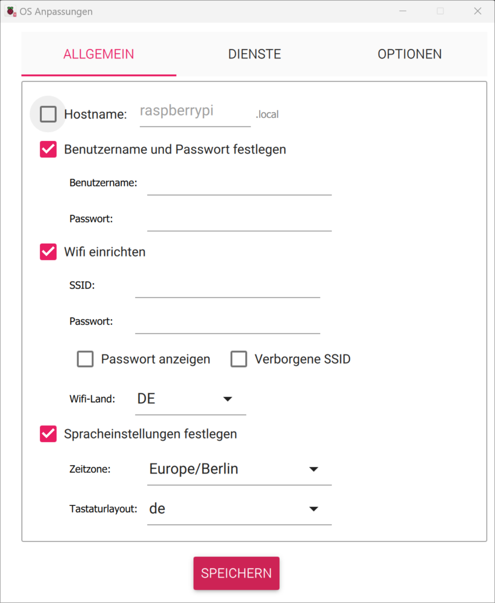
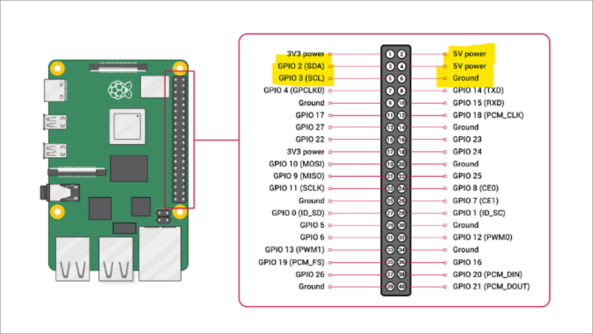

# Documentation: Emotional Robotics

## Project Goal

The goal of this interdisciplinary project is to develop a small robotic head that makes human-robot interaction appear more human-like.

The following elements can be controlled:

- Eye movement
- Eyelids
- Eyebrows
- Left / Right
- Up / Down
- Side tilt

These components are used to express human emotions.

## Project Structure

The project is divided into the following main areas:

1. **Hardware**
2. **Low-Level Software** (Servo control, ROS integration)
3. **High-Level Software** (AI-driven emotion representation)

---

## Low-Level Software

### Tasks

- Controlling the servo motors
- Creating a model in URDF
  - Linking servos with URDF positions
- Controlling 15 servos via PWM controller

### Steps

#### Selecting Hardware

- **Microcontroller or Raspberry Pi?**
  - Decision: **Raspberry Pi Zero 2W**
    - ROS2 support
    - HD camera connection possible
    - No micro-ROS required
  - Additionally required: **PWM Controller PCA9685** for servo control

#### Choosing the Operating System

- **Ubuntu 22.04 Server**
  - **Why?**
    - No graphical interface → lower resource usage
    - Officially supported by **ROS 2 Humble**

#### Installing Ubuntu

1. Install **Raspberry Pi Imager** on PC
2. Select **Ubuntu 22.04.5 LTS (64-bit ARM)** (version with support for Zero 2W)
3. **Configuration:**
   - Username: `emotional`
   - Password: `123456`
   - Set up Wi-Fi connection
   - Enable SSH with password
   - **Do not set hostname!** (We had issues)
4. **Apply settings & flash**
#### Attention: Choose 64-bit, not 32-bit as shown in the image




---

### Accessing the Raspberry Pi via SSH

Since Ubuntu Server has no graphical interface, access is via SSH.
PC and Raspberry Pi must be on the same local network.

1) Find private PC IP address:
   ```
   ip a
   ```

2) Find Raspberry Pi IP address:
   ```
   sudo nmap -sn <private PC IP address>/24
   ```
   - Scans IP addresses in the local network (do not run in university networks!)
   - Here assumed `/24` as subnet mask

3) Connect:
   ```
   sudo ssh emotional@<private IP address of Pi>
   ```

### Installing ROS 2

- Install ROS 2 Humble following the [official documentation](https://docs.ros.org/en/humble/Installation/Ubuntu-Install-Debs.html)
  - Select `ros-humble-ros-base`, not desktop

---

### File Access with SSHFS

- To access Raspberry Pi files from the PC and exchange data, `sshfs` can be used.
- `sshfs` mounts a directory from the Pi to the PC.

##### On the Pi:
```
mkdir ~/pi
```

##### On the PC/Laptop:
```
mkdir ~/pi_mount
sudo apt install sshfs
sshfs emotional@<IP address>:/home/emotional/pi pi_mount -o allow_other
```

Now, files can be accessed under `pi_mount`.

---

### Preparing the Raspberry Pi

```
sudo apt-get update
sudo apt install linux-modules-extra-raspi
```
Install a text editor, e.g., Vim or Nano:
```
sudo apt install nano
```
Add another Wi-Fi connection:
```
sudo apt-get install openvswitch-switch-dpdk
sudo nano /etc/netplan/50-cloud-init.yaml
```
Then add additional connections if desired.
Apply changes:
```
sudo netplan apply
```

Various ROS 2 dependencies will need to be installed later. Identify them from error messages. :)

I2C permissions:
```
sudo usermod -aG i2c $USER
sudo usermod -aG dialout $USER
```

---

## ROS 2 Project Information

### Creator Linhao Guo, Zexuan Zhang

### Creating a Workspace

- Guide: [Creating a workspace](https://docs.ros.org/en/humble/Tutorials/Beginner-Client-Libraries/Creating-A-Workspace/Creating-A-Workspace.html)

### Packages in this Project:
1. `mybot`
2. `mybot_interfaces`
3. `pwm_pca9685`

`mybot` and `mybot_interfaces` are our packages, `pwm_pca9685` is a library from GitHub.  
`mybot` abstracts the head and tells `pwm_pca9685` to move the servos.

###  ROS2 Components in mybot

#### **Nodes**

1. `jointstate_publisher_node.cpp`
   - Outputs the rotation of all axes (including eyebrow movement)
   - Uses URDF for visualization
   - Zexuan created this file, established the fundamental basics, and integrated it with the motor_node.
   - Linhao enhanced, refined, and completed the functions to enable movement with URDF and also on the real robot.
2. `motor_node.cpp`
   - Controls all motors
   - **Subscriber** of `jointstate_publisher`
   - **Explanation of Publisher/Subscriber:** [ROS 2 Publisher/Subscriber](https://docs.ros.org/en/humble/Tutorials/Beginner-Client-Libraries/Writing-A-Simple-Cpp-Publisher-And-Subscriber.html)
   - Zexuan created this file, established the fundamental basics.
3. `face_tracking_node.cpp`
   - Send messages to jointstate_publisher_node with movement.
   - Automaticly moves the head statically in a cycle of states.
   - Receives a message from a topic.
   - Made by Linhao

#### **URDF Model**

- Creates a logical model of the head
- **Components:**
  - `link` → Body part or object
  - `joint` → Connecting joints
- Colors are adjustable
- Linhao and Zexuan researched the fundamentals of URDF.
- After the test workes Linhao created the virtual head and finally adjusted the angle limits based on realistic tests.

#### **Rviz (Visualization)**

- Displays the URDF model
- The Rviz file defines the graphical content
- made by Linhao

#### **Launch Scripts**

- Starts Rviz and nodes
- loads all relevant data
- Guide: [Creating a launch file](https://docs.ros.org/en/humble/Tutorials/Intermediate/Launch/Creating-Launch-Files.html)
- Made by Zexuan.

#### **Custom Interfaces (`mybot_interfaces`)**

- **Add service file `Rotate.srv`**
- **Explanation of ROS 2 Services:** [ROS 2 Interfaces](https://docs.ros.org/en/humble/Concepts/Basic/About-Interfaces.html)
- Made by Zexuan.

#### **CmakeLists**

-  Used for compiling the ROS 2 package, defining dependencies, and generating executables and libraries.
-  we have to always update the file after change any of the node from the package.

#### **package**

-  Used for managing the ROS 2 package, declaring the package name, dependencies, maintainers, etc.
-  we have to always update the file after change any of the node from the package.

---

### Cross compile for ARM64
Compiling ROS2 packages on the Pi Zero did not work for some reason, neither on the bigger pi.
Instead, we used Docker with QEMU to compile the packages on a x86_64 for ARM64.  

Here is one way to do it on **Arch Linux**. On Debian/Ubuntu, it is likely similar, just replace the `pacman` parts. 

Basic knowledge on what images and containers are, is assumed. Just copy paste the commands tho
#### Preparation:
Install Docker, which is needed to create and manage containers.
```
sudo pacman -S docker
```
To use docker without sudo
```
sudo usermod -aG docker $(whoami)
```
Enable Docker service
```
systemctl enable docker.service
```
Install qemu-user-static, which allows running ARM64 binaries on x86_64

```
sudo pacman -S qemu-user-static
sudo pacman -S qemu-user-static-binfmt
# on debian only qemu-user-static I believe
```
Install docker-buildx, a builder for multi-platform Docker images and enable it
```
sudo pacman -S docker-buildx
```
Set up QEMU for multi-architecture support inside Docker. [Source](https://docs.docker.com/build/building/multi-platform/)

```
docker run --privileged --rm tonistiigi/binfmt --install all
```

If QEMU doesn't work for example after a reboot, you could try the following:
```
docker run --rm --privileged multiarch/qemu-user-static --reset -p yes
```

Create a directory for mounting the container:
```
mkdir ~/docker_mount
```
A Dockerfile for ROS installation is in this repo. To create an image using it, move in the directory with the Dockerfile and:
```
docker buildx build --platform linux/arm64 --load -t armros .
```


Create and start a container with the created image and enter it:
```
docker run --name armcross -it --platform linux/arm64 -v ~/docker_mount:/root armros bash
```

Here, the project can be compiled.
`exit` to leave the container.

#### Reusing a stopped container:
```
docker ps                       # lists running containers
docker ps -a                    # List all containers

docker start armcross           # runs the container armcross

docker exec -it armcross bash   # Enters the running container armcross

docker stop armcross            # stops the container
``` 
---

### View GPIO Pin Assignment  
Using the command `gpio pinout` or refer to the image:  

  

### Controlling the PCA9685 Motor Controller  

- Using the corresponding library: [https://github.com/BrettRD/ros-pwm-pca9685/tree/ros2](https://github.com/BrettRD/ros-pwm-pca9685/tree/ros2)  
- **Servo Datasheet:** [DSPower Servo DS-M005B](https://www.dspowerservo.com/ds-m005b-0-5kg-high-precision-copper-gear-coreless-2g-micro-servo-product/)  
  - Relevant information: Pulse Width Range  
  - In `pca9685_node.cpp`, pwm_min, pwm_max and timeout_value must be set according to the motor specifications.  
  - This is not the only servo being used.  
    - This was previously unknown; the values in `pca9685_node.cpp` need to be adjusted for the other motors accordingly.  

#### Directly Controlling the Motors  

"exactly 16 values corresponding to the 16 PWM channels. For each value, specify -1 to make no update to a channel. Specify a value between 0 and 4095 inclusive to update the channel's PWM value."

```
source /opt/ros/humble/setup.bash
source /<path_to_pwm>/pwm/install/local_setup.bash
ros2 run pwm_pca9685 pca9685_node
ros2 topic pub /command std_msgs/msg/Int32MultiArray "{data: [-1, -1, -1, -1, -1, -1, -1, -1, -1, -1, -1, -1, -1, -1, -1, -1]}"
```  

---

### Compiling with `colcon build`  

For `mybot` and `mybot_interface`:  
```
source /opt/ros/humble/setup.bash
cd <path_to_mybot>/ros2_ws
colcon build --packages-select mybot_interfaces --cmake-clean-cache
source /<path_to_mybot>/ros2_ws/install/setup.bash
colcon build
source /<path_to_mybot>/ros2_ws/install/setup.bash
```  

For `pwm_pca9685`:  
```
source /opt/ros/humble/setup.bash
cd <path_to_pwm>/pwm
colcon build
source install/local_setup.bash
```  

## Starting the Robot  

### Launching the Project  
```
source /opt/ros/humble/setup.bash
source /<path_to_pwm>/pwm/pwm_pca9685/install/local_setup.bash
source /<path_to_mybot>/ros2_ws/install/setup.bash
ros2 launch mybot mybot_launch.py
ros2 run pwm_pca9685 pca9685_node
```  

### A Way to Update Joint Angles:  
```
ros2 service call /set_joint_angles mybot_interfaces/srv/Rotate "{angle_motor_1_1: 0.7, angle_motor_1_2: 0.9, angle_motor_1_3: -0.4, angle_motor_2_1: -0.7, angle_motor_2_2: 0.2, angle_motor_2_3: -0.1}"
```  

- **0.7 corresponds to the angle in radians**
- angle_motor_ and corresponding motor (from the robot's perspective):
  - 1_1: Right eye (left/right movement)
  - 1_2: Right eye (up/down movement)
  - 1_3: Right eyelid (up/down movement)
  - 1_4: Right eyebrow outer node (rotation)
  - 1_5: Right eyebrow (up/down movement)
  - 1_6: Right eyebrow inner node (rotation)
  - 2_1: Left eye (left/right movement)
  - 2_2: Left eye (up/down movement)
  - 2_3: Left eyelid (up/down movement)
  - 2_4: Left eyebrow outer node (rotation)
  - 2_5: Left eyebrow (up/down movement)
  - 2_6: Left eyebrow inner node (rotation)
  - 3_1: Head (up/down movement)
  - 3_2: Head (left/right rotation)
  - 3_3: Head (up/down movement)

## For the future

- Optimize the 3D modeling and motion effects of the URDF in Rviz.
- The robot was not tested in the final stage.
- Our results have not yet been tested with the high-level team's results.
- The different emotional states in face tracking have not been determined yet.
- pwm configuration for all motors (neck movement mostly)
---

### Credits

Marc: hardware selection,Linux installation, pwm, docker, integration testing, documentation  

Martin: hardware selection,Linux installation, electronics, documentation 

linhao: linux installation, integration testing, see section "ROS2 Components in mybot"  

Zexuan: linux installation, see section "ROS2 Components in mybot"  


